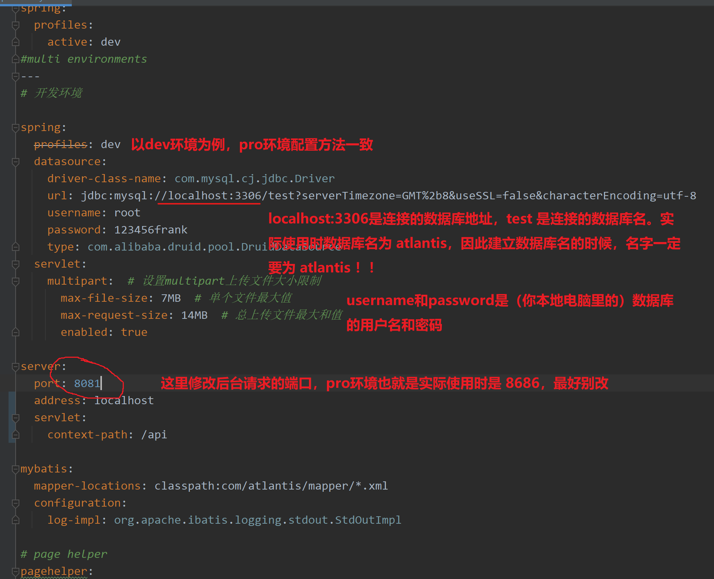
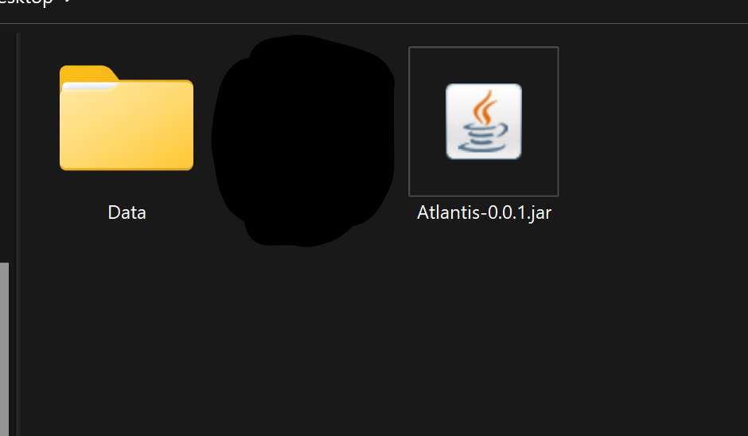
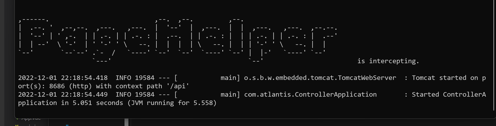

# `Atlantis Racer` 项目部署

主要参考文章：[CSDN](https://blog.csdn.net/qq_43228403/article/details/123076602)

步骤：

* 克隆我的 [GitHub](https://github.com/CS0522/Atlantis) 仓库

* 后端部署：  
  
  * 数据库的建立：  
    第一种就是按照我的配置去建立，安装 [MySQL(8.0.30及以后) ](https://downloads.mysql.com/archives/installer/)，选择 450mb 离线安装包。<span style="color: red">配置端口号 3306，默认用户 root，密码 123456frank </span>。运行成功后，建立数据库 `atlantis`，运行仓库内的 `sql` 文件，建表成功后刷新看到共10张表后即成功。  
    第二种就是自己配，同时记得修改下文中的 `application.yml` 为跟你本地的数据库对应的配置。

  * `application.yml` 文件解释及修改：  
  
      

  * 打 `jar` 包前的准备：  
    由于本项目是分模块开发，利用了 `maven` 的聚合和继承。因此重点是是将本项目下的所有 `pom.xml` 下的 `spring-boot-maven-plugin` 全部注释掉（注释掉整个 `<build></build>` 标签）。<span style="color: red">进入 `controller` 模块中的 `pom.xml`，保留其中的 `spring-boot-maven-plugin`</span>。同时父工程（最外层）的 `pom.xml` 记得修改打包方式为 `pom`。  

  * 打 `jar` 包：  
    先执行 `clean`，后执行 `package`。正常这个时候已经成功了。在控制台的打印输出中，找到该文件（大小应该 20mb 往上），可以单独复制出去，可以改名。同时将 `项目根目录/Data` 文件夹复制到 `jar` 文件同一级路径下。如下图：  
        

  * 启动：
    在该路径下，打开 `cmd`，输入 `java -jar XXX.jar --spring.profiles.active=pro --server.port=8686`。`--spring.profiles.active` 选择哪个环境，`--server.port` 选择端口（pro环境默认为 8686）。当运行如下图时，即后端开启成功：  
    
  
* 前端部署：
  
  * `./src/utils/baseUrl.js` 文件解释及修改：
    这里统一定义了请求后端的访问路径。与后端的IP和端口对应。
      
  * 项目打包：  
    `cmd` 进入项目根目录，如：`C:\Users\Frank\OneDrive\Codes\My Projects\ProTraining Projects\Atlantis\atlantis-front>`，运行 `npm run build`（在此之前先确认根目录下有没有 `node_modules` 文件，没有的话，管理员 `cmd` 进入根目录输入 `npm install`，待不报错并正确执行完后，在 执行 `npm run build`）。待打包成功后，根目录下多出 `dist` 文件夹，将这个文件夹复制。

  * 下载 `nginx`（仓库里我已经将 `nginx` 配置好了，解压即可）：  
    选择 [稳定版](http://nginx.org/en/download.html)，解压到一个地方。  

  * 配置 `nginx`：
    首先将 `dist` 文件夹直接复制到 nginx 安装目录下的 `html` 文件夹中，即路径为 `/nginx/html/dist`。之后打开 `nginx/conf` 路径下的 `nginx.conf`，记事本打开即可，建议有代码高亮更好。修改 `server` 配置，注意注释，如下：  

    ```yml
    server {
        # 监听端口
        # 如：http://localhost:80，就可以进页面
        # 这里设定的就是访问 8686 端口其实也可以进入页面
        # 要想只有 80 端口进入页面的话，就把 8686 端口单独放在一个 server{} 里，然后只写 location /api/
        listen       80;
        listen       8686;
        # 这里可以填多个，具体百度下咋填，怎么跟域名联系
        server_name  localhost;

        # 这四个可以不用，前端 axios 请求中已经添加
        # 允许跨域请求的域，* 代表所有
        # add_header 'Access-Control-Allow-Origin' *;
        # 允许带上cookie请求
        # add_header 'Access-Control-Allow-Credentials' 'true';
        # 允许请求的方法，比如 GET/POST/PUT/DELETE
        # add_header 'Access-Control-Allow-Methods' *;
        # 允许请求的header
        # add_header 'Access-Control-Allow-Headers' *;

        #charset koi8-r;

        #access_log  logs/host.access.log  main;

        location / {
            # 修改如下
            # root 即是刚刚 dist 文件放入的位置，这里是相对路径
            root   html/dist;
            index  index.html index.htm;
            try_files $uri $uri/ /index.html;
        }

        # 修改（添加）如下
        location /api/ {
            # 项目工程里axios请求的是8686端口。如果后端切换到8082，则nginx要进行反向代理
            # 监听8686端口，如果有发送到8686端口请求，则转发到8082
			# proxy_pass http://localhost:8082/api/;
            # pro 环境下
            proxy_pass http://localhost:8686/api/;
			# proxy_set_header Host $HOST;
			# rewrite "^/api/(.*)" /$1 break;
		}

        #error_page  404              /404.html;

        # redirect server error pages to the static page /50x.html
        #
        error_page   500 502 503 504  /50x.html;
        location = /50x.html {
            root   html;
        }
    }
    ```  

  * 启动 `nginx`：  
    双击 `nginx.exe`，或者在 `nginx` 安装目录下打开 `cmd`，输入 `nginx`，出现黑框，且里面什么内容都没提示的话，应该是正常启动了。以下是常用命令：

    ```c
    //启动nginx（常用）
    start nginx 
    //检查nginx是否启动成功命令(检查nginx及其所有子线程)
    tasklist /fi "imagename eq nginx.exe" 
    //关闭或停止最后一次运行的nginx
    nginx -s stop
    //完整有序的停止最后一次运行的nginx
    nginx -s quit
    //完全停止所有nginx及其子线程（常用）
    taskkill /f /t /im nginx.exe
    ```